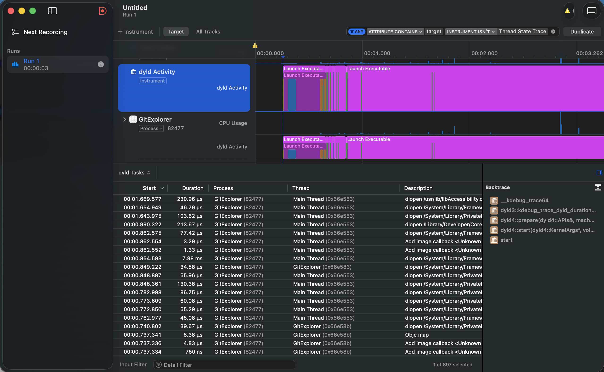
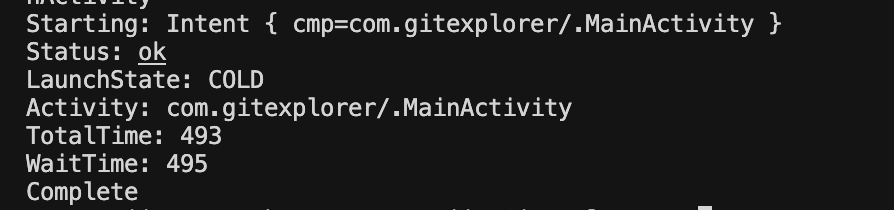
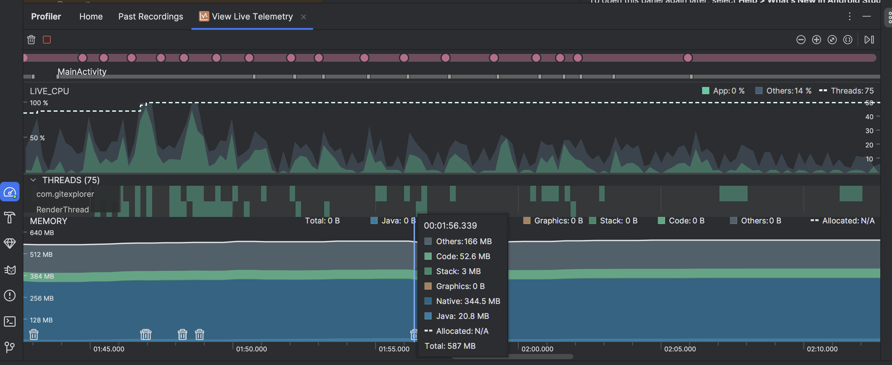
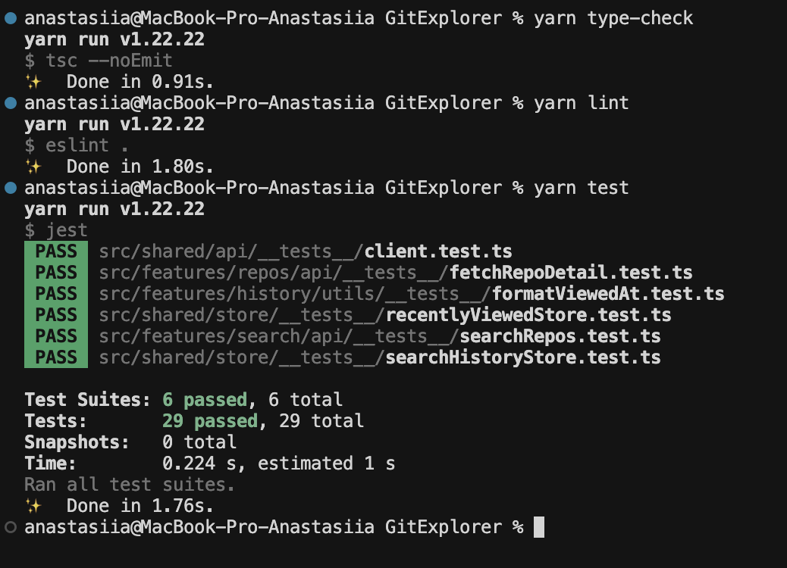

# GitExplorer

[](https://reactnative.dev/)
[](https://www.typescriptlang.org/)
[](https://hermesengine.dev/)
[](https://reactnative.dev/)
[](./docs/screenshots/tests.png)
[](./docs/screenshots/tests.png)

A React Native app for searching and exploring GitHub repositories. Search by keyword, browse results with infinite scroll, view repository details, and keep track of recently viewed repos.

<p align="center">
  
  &nbsp;&nbsp;&nbsp;&nbsp;
  
</p>

---

## Getting Started

### Prerequisites

- Node.js >= 22.11.0
- Yarn
- Xcode (iOS) / Android Studio (Android)
- CocoaPods (iOS)

### Installation

```bash
git clone https://github.com/dovban-ds/GitExplorer.git
cd GitExplorer
yarn setup
```

### Running

```bash
yarn ios        # Run on iOS
yarn android    # Run on Android
yarn test       # Run tests
```

---

## Tech Stack

| Category | Library | Why |
|---|---|---|
| **Navigation** | React Navigation v7 (native-stack) | Smooth transitions between screens, an intuitive API, and this is kind of standard |
| **Server State** | TanStack Query v5 | `useInfiniteQuery` for infinite scroll, built-in caching for partial offline support, automatic retry, background refetch, stale-while-revalidate |
| **Client State** | Zustand v5 + react-native-mmkv v4 | Zustand manages search history and recently viewed repos; MMKV provides synchronous persistence |
| **HTTP** | Axios | Interceptor architecture critical for planned OAuth (in future, check what I'd improve section) - request interceptor for automatic Bearer token injection, response interceptor for global 401/token-expiry handling |
| **Lists** | FlashList v2 (`@shopify/flash-list`) | Recycled component pool vs FlatList's full re-renders. v2 removes `estimatedItemSize`, so sizing is handled automatically |
| **Images** | react-native-fast-image | Caching for avatars |
| **Icons** | lucide-react-native | Modern, actively maintained alternative to the deprecated react-native-vector-icons. Tree-shakeable and TypeScript-native |
| **Animations** | react-native-reanimated v4 | Skeleton loader |
| **Date formatting** | Day.js + relativeTime plugin | 2 KB size, used for last interaction and updatedAt |
| **Dev tooling** | Reactotron | Network request logging for GitHub API calls, Zustand state inspection. Wrapped in a `__DEV__` guard — zero production overhead |

I think this is a very modern and powerful stack for React Native.
In the current implementation, Zustand might seem unnecessary, but it’s a really cool tool for the future, and here I’ve added a view history to showcase the state manager at this early stage

---

## Architecture

### Feature-Based Structure

```
src/
├── app/                  # Entry point, providers (QueryClient, NavigationContainer)
├── features/
│   ├── search/           # SearchBar, SearchHistoryList, SearchScreen, EmptyHomeState
│   ├── repos/            # RepoCard, RepoListScreen, RepoDetailScreen
│   └── history/          # HistoryScreen — recently viewed repos
├── shared/
│   ├── api/              # Axios client with OAuth interceptor placeholder
│   ├── components/       # ErrorBoundary, Header, Skeleton, EmptyState
│   ├── constants/        # Colors design tokens, API constants
│   ├── store/            # Zustand slices (searchHistory, recentlyViewed)
│   ├── types/            # GitHub API interfaces (Repo, RepoOwner, SearchResponse)
│   └── utils/            # formatCount, formatViewedAt, toast helpers
└── navigation/           # Typed RootNavigator, useAppNavigation, useAppRoute hooks
```

### Why Feature-Based?

| Alternative | Problem |
|---|---|
| **Layer-based** (`screens/`, `components/`, `hooks/`) | Doesn't scale past ~20 files — unrelated code in the same folder |
| **FSD** | Powerful but over-engineered for this scope |
| **Modular / monorepo** | Excessive tooling overhead for a single app |

### Key Decisions

- **Barrel exports** (`index.ts`) serve as the public API for each feature
- **ESLint `no-restricted-imports`** enforces barrel-only imports between features
- **`import/no-internal-modules`** blocks relative cross-feature imports
- **Colors design tokens** live in `shared/constants/colors.ts` — single source of truth
- **Shared promotion rule**: code moves to `shared/` only when used by 2+ features

### Trade-offs

- I'm not a big fan of storing styles and types together with the UI, but that's a bit of a holywar topic. In my case, these are small components, the types aren't duplicated, and they're clearly tied to that specific component—so it makes sense. But in any case, this structure is supplemented by **./types** and **./styles** folders for each feature - that way, it will be more modular.
- `shared/` can become a dumping ground (mitigated by the 2-feature promotion rule)
- No strict runtime boundary enforcement between features, only ESLint rules
- Adding a new feature requires manually updating ESLint forbid patterns

---

## Performance

### iOS Cold Start

<p align="center">
  
</p>

- **~1.7 s** debug build measured via Xcode Instruments App Launch template
- Debug overhead: Hermes JS compilation at runtime, Reactotron init, dev warnings
- Native library loading (dyld): **~370 ms** — Reanimated, MMKV/NitroModules, FastImage, SVG

### Android Cold Start

<p align="center">
  
</p>

Measured via `adb shell am start -W`.

### Memory Usage (Android)

<p align="center">
  
</p>

| Segment | Debug |
|---|---|
| Native | 344.5 MB (Hermes VM + NitroModules/Worklets separate JS runtime + FastImage cache) |
| Code | 52.6 MB |
| Java | 20.8 MB |
| **Peak total** | **~587 MB** |

This is Debug build, thus keep in mind Reactotron, dev runtime, non-optimized by Hermes code etc.

### 60 FPS Scrolling

<p align="center">
  
  &nbsp;&nbsp;&nbsp;&nbsp;
  
</p>

- FlashList v2 with recycled component pool
- `React.memo` on `RepoCard` prevents unnecessary re-renders
- `useCallback` on `renderItem` and `keyExtractor`

### Tests

<p align="center">
  
</p>

- **6 suites, 29 tests** — all passing
- **95.9% statement coverage, 100% branch coverage**
- Covers: store actions, deduplication logic, API layer, utility functions

---

## What I'd Improve with More Time

I see this idea evolving into the ability to log in to your Git account using OAuth, as well as the ability to view your profile, star other repositories, view issues, and so on
The current architecture can handle this scalability just fine

In addition, I would spend some time on styling: SafeArea is used everywhere, but it’s probably worth adjusting the content and placing it a little further from the device’s edges. It’s also worth improving the keyboard behavior and ignoring screen taps when it’s open. And double-check all hit slops for interactive icons across the entire app

---

## APK Download

Via [Releases](https://github.com/dovban-ds/GitExplorer/releases/tag/demo) tab

Built with:

```bash
./gradlew assembleRelease
```
